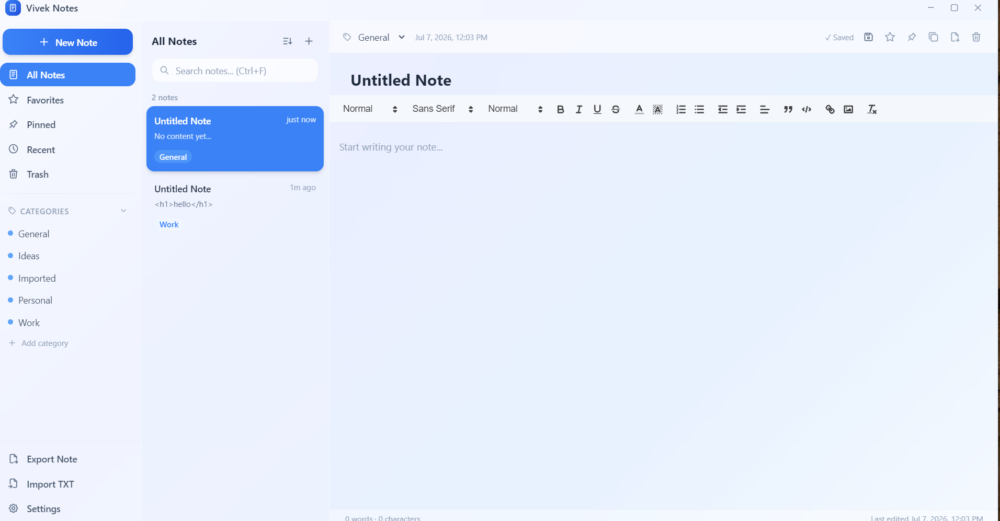

# Vivek Notes

A professional Windows desktop note-taking application built with Electron + React + NeDB.

## Screenshot



## Features

- **Rich Text Editor** — Bold, italic, underline, headings, lists, links, images, tables, colors
- **Auto Save** — Saves as you type (configurable delay)
- **Organize** — Categories, favorites, pinned notes
- **Search** — Real-time full-text search across title, content, and category
- **Sort** — By last edited, date created, or title
- **Trash** — Soft-delete with restore and empty-trash
- **Export** — TXT and HTML export
- **Import** — TXT file import
- **Backup** — Manual and automatic backup every 5 minutes (JSON format)
- **Settings** — Font family, font size, auto-save toggle, default category, backup folder
- **Keyboard Shortcuts** — Ctrl+N, Ctrl+S, Ctrl+F, Ctrl+D, Ctrl+Z, Ctrl+Y
- **Custom Title Bar** — Minimize, maximize, close with drag support
- **Glassmorphism UI** — Windows 11-inspired design with soft shadows and blur

## Build & Run

### Prerequisites
- Node.js 18+
- npm 9+

### Development
```bash
npm install --legacy-peer-deps --ignore-scripts
npm run dev
```

### Production Build (Windows .exe)
```bash
npm run build:electron
```
Output files will be in `dist-electron/`:
- `Vivek Notes Setup 1.0.0.exe` — NSIS installer with desktop shortcut
- `Vivek Notes 1.0.0.exe` — Portable executable

## Project Structure

```
notepad/
├── electron/
│   ├── main.js          # Electron main process
│   ├── preload.js       # Context bridge API
│   └── database.js      # NeDB data layer
├── src/
│   ├── components/
│   │   ├── TitleBar.jsx       # Custom window chrome
│   │   ├── Sidebar.jsx        # Navigation + categories
│   │   ├── NoteList.jsx       # Note cards panel
│   │   ├── Editor.jsx         # Quill rich text editor
│   │   ├── SearchBar.jsx      # Real-time search input
│   │   ├── ContextMenu.jsx    # Right-click menu
│   │   ├── SettingsModal.jsx  # Settings dialog
│   │   └── Toast.jsx          # Notification toasts
│   ├── hooks/
│   │   ├── useNotes.js        # Notes state & API calls
│   │   └── useSettings.js     # Settings state & API calls
│   ├── utils/
│   │   └── helpers.js         # Date formatting, text utilities
│   ├── App.jsx                # Root component
│   ├── main.jsx               # React entry point
│   └── index.css              # Global styles + Tailwind
├── assets/
│   └── icon.ico               # App icon (256x256)
├── screenshots/
│   └── app-screenshot.png     # App screenshot
├── scripts/
│   └── create-icon.js         # Icon generator utility
├── package.json
├── vite.config.js
├── tailwind.config.js
└── README.md
```

## Keyboard Shortcuts

| Shortcut | Action |
|----------|--------|
| `Ctrl + N` | New Note |
| `Ctrl + S` | Save Note |
| `Ctrl + F` | Search |
| `Ctrl + D` | Duplicate Note |
| `Ctrl + Z` | Undo |
| `Ctrl + Y` | Redo |

## Tech Stack

| Layer       | Technology                |
|-------------|---------------------------|
| Shell       | Electron 29               |
| UI          | React 18 + Vite 5         |
| Styling     | Tailwind CSS 3            |
| Editor      | React-Quill (Quill.js)    |
| Database    | @seald-io/nedb (pure JS)  |
| Icons       | React Icons 5             |
| Build       | electron-builder 24       |

## Data Storage

Notes are stored in `%APPDATA%\vivek-notes\vivek-notes-db\` as NeDB flat-file databases.
Auto-backups are saved to `%APPDATA%\vivek-notes\backups\` every 5 minutes.

## Publisher

**Vivek Sawji** — Version 1.0.0
